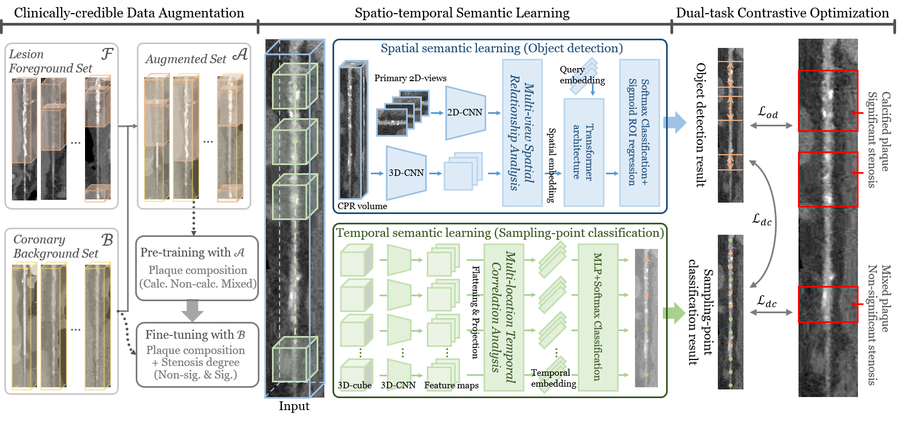

# CAD_diagnosis

The implementation of our works:
A Trusted Lesion-assessment Network for Interpretable Diagnosis of Coronary Artery Disease in Coronary CT Angiography
["Spatio-Temporal Contrast Network for Data-Efficient Learning of Coronary Artery Disease in Coronary CT Angiography"](https://link.springer.com/chapter/10.1007/978-3-031-72120-5_60).

## Overview

<p align="center">
    
</p>

## Requirements  

The required packages include Python `3.9`, PyTorch `1.12`, einops, nibabel, numpy, scipy, and torchvision.

## Citation

```latex
@inproceedings{ma2024spatio,
  title={Spatio-Temporal Contrast Network for Data-Efficient Learning of Coronary Artery Disease in Coronary CT Angiography},
  author={Ma, Xinghua and Zou, Mingye and Fang, Xinyan and Liu, Yang and Luo, Gongning and Wang, Wei and Wang, Kuanquan and Qiu, Zhaowen and Gao, Xin and Li, Shuo},
  booktitle={International Conference on Medical Image Computing and Computer-Assisted Intervention},
  pages={645--655},
  year={2024},
  organization={Springer}
}
```

## Acknowledgment

- Detection Transformer: https://github.com/facebookresearch/detr
- Data Preprocessing: https://github.com/jackyko1991/Multiplanar-Reconstruction
